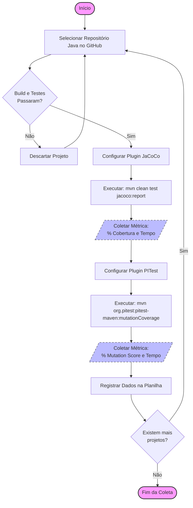

# Entrega 1: Identificação Básica, Contexto e Problema

## 1. Identificação básica

### 1.1 Título do experimento
Análise Comparativa de Eficácia na Detecção de Falhas: Cobertura de Código (Code Coverage) versus Teste de Mutação em Aplicações Java.

### 1.2 ID / código
EXP-QA-MUTATION-2025

### 1.3 Versão do documento e histórico de revisão
* **Versão atual:** v1.0
* **Histórico:**
    * 22/11/2025: Criação inicial do documento com definição de escopo e problema.

### 1.4 Datas
* **Criação:** 22/11/2025
* **Última atualização:** 22/11/2025

### 1.5 Autores
* **Nome:** Ryan Cristian Oliveira Rezende
* **Área:** Engenharia de Software / Qualidade de Software
* **Contato:** rcorezende@sga.pucminas.br

### 1.6 Responsável principal (PI / dono do experimento)
Ryan Cristian Oliveira Rezende

### 1.7 Projeto / produto / iniciativa relacionada
Trabalho de Conclusão de Curso (TCC) – Investigação sobre métricas de qualidade de software e confiabilidade de suítes de testes.

---

## 2. Contexto e problema

### 2.1 Descrição do problema / oportunidade
No desenvolvimento de software, a **Cobertura de Código (Code Coverage)** é usada por quase todas as empresas como a métrica padrão para medir a qualidade dos testes. É comum ver metas como "mínimo de 80% de cobertura" para aceitar um Pull Request.

O problema principal é a falsa sensação de segurança que isso gera: a chamada "ilusão de qualidade". É perfeitamente possível ter 100% de cobertura com testes fracos, que executam o código mas não têm asserções (assertions) capazes de pegar erros de lógica. Isso resulta em código que passa no CI/CD, mas quebra em produção.

A oportunidade deste trabalho é verificar na prática se o **Teste de Mutação (Mutation Testing)** — que insere bugs propositais no código para ver se os testes falham — é uma métrica mais honesta e confiável do que a cobertura tradicional.

### 2.2 Contexto organizacional e técnico
* **Ambiente:** O experimento será executado no meu notebook pessoal (Sistema Operacional Windows 10/11), garantindo isolamento de recursos durante a execução.
* **Stack Tecnológica:** Projetos open-source em **Java**.
* **Ferramentas:**
    * **JUnit 5:** Para rodar os testes unitários.
    * **JaCoCo:** Para medir a cobertura tradicional.
    * **PITest:** A ferramenta padrão de mercado para teste de mutação em Java (JVM).
* **Objeto de Estudo:** Módulos de lógica de negócios (Backend) com diferentes níveis de complexidade.

### 2.3 Trabalhos e evidências prévias
A literatura especializada em Engenharia de Software e Qualidade aponta que cobertura de código é necessária, mas não suficiente.
Estudos da área indicam que suítes de teste com alta cobertura frequentemente deixam passar falhas críticas. Por outro lado, o teste de mutação costuma ser mais eficaz em expor a fragilidade desses testes, embora seja menos usado na indústria por ser considerado "pesado" computacionalmente. A ideia é investigar esse trade-off.

### 2.4 Referencial teórico e empírico essencial
O experimento vai se basear em quatro conceitos principais:
1.  **Code Coverage (Cobertura):** Métrica simples que diz quantas linhas de código foram executadas.
2.  **Mutation Testing (Teste de Mutação):** Técnica que altera o código original (criando "mutantes", ex: trocando um `+` por `-`) para testar a qualidade do teste. Se o teste falhar, o mutante "morreu" (o que é bom).
3.  **Hipótese do Programador Competente:** A teoria de que a maioria dos bugs são erros simples de sintaxe ou lógica básica.
4.  **Efeito de Acoplamento:** A ideia de que testes capazes de pegar erros simples (mutantes) também acabam pegando erros complexos indiretamente.

## 3. Objetivos e Questões (GQM - Goal / Question / Metric)

### 3.1 Objetivo Geral (Goal Template)
**Analisar** a eficácia da métrica de Cobertura de Código (Code Coverage) comparada à Pontuação de Mutação (Mutation Score)
**Com o propósito de** avaliar a confiabilidade dos testes automatizados e identificar a "ilusão de qualidade"
**Sob a perspectiva** do Engenheiro de Software e Engenheiro de Qualidade (QA)
**No contexto de** projetos open-source em Java utilizando JUnit 5.

### 3.2 Tabela GQM (Objetivos Específicos, Questões e Métricas)

| Objetivos Específicos | Questões de Pesquisa (Q) | Métricas Associadas (M) |
| :--- | :--- | :--- |
| **O1. Analisar a correlação entre Cobertura e Robustez** Verificar se existe relação direta entre cobrir linhas e matar mutantes. | **Q1.1** Projetos com alta cobertura de linha (>80%) apresentam pontuação de mutação proporcionalmente alta? | M1. Line Coverage (%) M2. Mutation Score (%) |
| | **Q1.2** Existem casos de "falsos positivos" onde a cobertura é alta mas a pontuação de mutação é baixa (<50%)? | M1. Line Coverage (%) M2. Mutation Score (%) |
| | **Q1.3** A cobertura de desvio (branch) é um preditor melhor para a pontuação de mutação do que a cobertura de linha? | M3. Branch Coverage (%) M2. Mutation Score (%) |
| **O2. Avaliar o custo computacional (Trade-off)** Comparar o impacto no tempo de execução entre as técnicas. | **Q2.1** Qual é a sobrecarga temporal (overhead) introduzida pelo teste de mutação em relação à execução normal dos testes? | M4. Test Execution Time (ms) M5. Mutation Analysis Time (ms) |
| | **Q2.2** O tamanho do projeto (linhas de código) influencia exponencialmente o tempo de análise de mutação? | M6. Lines of Code (LOC) M5. Mutation Analysis Time (ms) |
| | **Q2.3** O número de classes de teste impacta mais o tempo de cobertura ou o tempo de mutação? | M7. Number of Test Classes M5. Mutation Analysis Time (ms) |
| **O3. Investigar a natureza dos defeitos não detectados** Entender o que compõe a "falta de qualidade". | **Q3.1** Qual é a proporção de mutantes que sobrevivem mesmo em linhas cobertas pelos testes? | M8. Surviving Mutants Count M1. Line Coverage (%) |
| | **Q3.2** A complexidade do código fonte (Ciclomática) aumenta a taxa de sobrevivência dos mutantes? | M9. Cyclomatic Complexity (Avg) M8. Surviving Mutants Count |
| | **Q3.3** Testes que cobrem mais métodos tendem a matar mais mutantes? | M10. Methods Covered Count M2. Mutation Score (%) |
| **O4. Analisar a eficiência da suíte de testes** Verificar a densidade de eficácia dos testes criados. | **Q4.1** Qual a relação entre a quantidade de testes unitários e a pontuação de mutação obtida? | M11. Number of Test Methods M2. Mutation Score (%) |
| | **Q4.2** A força da suíte de testes (Mutation Score) varia significativamente entre diferentes projetos analisados? | M2. Mutation Score (%) M12. Project ID / Category |
| | **Q4.3** É viável estabelecer um limiar mínimo de Mutation Score para pipelines de CI/CD baseado nos dados coletados? | M5. Mutation Analysis Time (ms) M2. Mutation Score (%) |

---

## 3.3 Definição das Métricas

Abaixo estão listadas todas as métricas utilizadas no GQM acima.

| ID | Nome da Métrica | Descrição | Unidade | Fonte de Coleta |
| :--- | :--- | :--- | :--- | :--- |
| **M1** | Line Coverage | Porcentagem de linhas de código executadas durante os testes. | Percentual (%) | Relatório JaCoCo |
| **M2** | Mutation Score | Porcentagem de mutantes mortos (detectados) sobre o total de mutantes gerados. | Percentual (%) | Relatório PITest |
| **M3** | Branch Coverage | Porcentagem de ramificações (if/else, switch) executadas. | Percentual (%) | Relatório JaCoCo |
| **M4** | Test Execution Time | Tempo total para rodar a suíte de testes padrão (JUnit). | Milissegundos (ms) | Log JUnit/Maven |
| **M5** | Mutation Analysis Time | Tempo total para rodar a análise de mutação completa. | Milissegundos (ms) | Log PITest |
| **M6** | Lines of Code (LOC) | Total de linhas de código fonte Java (não vazias/comentários) do projeto. | Inteiro (Un) | Plugin de Análise/Sonar |
| **M7** | Number of Test Classes | Quantidade de classes Java dedicadas a testes no projeto. | Inteiro (Un) | Análise Estática |
| **M8** | Surviving Mutants Count | Número absoluto de mutantes que não foram detectados pelos testes. | Inteiro (Un) | Relatório PITest |
| **M9** | Cyclomatic Complexity | Média da complexidade ciclomática (caminhos independentes) dos métodos. | Inteiro (Un) | Relatório JaCoCo/Metrics |
| **M10** | Methods Covered Count | Número absoluto de métodos que foram invocados durante os testes. | Inteiro (Un) | Relatório JaCoCo |
| **M11** | Number of Test Methods | Quantidade total de métodos anotados com `@Test`. | Inteiro (Un) | Análise Estática |
| **M12** | Project Category | Categoria do projeto (ex: Utils, Web, Lib) para agrupamento. | Nominal (Texto) | Classificação Manual |

---

## 4. Escopo e Contexto do Experimento

### 4.1 Escopo Funcional (Inclusões e Exclusões)

| Escopo | Descrição |
| :--- | :--- |
| **Incluído (In-Scope)** | 1. Análise de código fonte em linguagem **Java** (versões 11 a 21). 2. Projetos que utilizam **JUnit 5** para testes unitários. 3. Ferramentas de automação de build: **Maven** ou **Gradle**. 4. Uso do **JaCoCo** para métricas de cobertura clássica. 5. Uso do **PITest** para métricas de mutação. 6. Testes unitários de backend/lógica de negócio. |
| **Excluído (Out-Scope)** | 1. Testes de Interface de Usuário (Selenium, Frontend). 2. Testes de Integração que dependam de Banco de Dados externo ou APIs reais (para evitar instabilidade). 3. Projetos em outras linguagens (Kotlin, Python, etc). 4. Análise manual de código (Code Review). |

### 4.2 Contexto do Estudo
* **Tipo de Organização:** Acadêmica / Pesquisa Experimental.
* **Objeto:** Projetos Open-Source hospedados no GitHub com boa reputação (estrelas) e atividade recente.
* **Perfil:** Projetos de bibliotecas e utilitários, pois possuem lógica de negócio isolada, ideal para testes unitários puros.

---

## 5. Stakeholders e Impacto Esperado

### 5.1 Stakeholders Principais
1.  **Engenheiros de Software (Devs):** Interessados em saber se seus testes atuais são confiáveis.
2.  **Engenheiros de QA / SDETs:** Interessados em adotar novas ferramentas para garantir qualidade além da cobertura.
3.  **Gerentes de Engenharia / Tech Leads:** Interessados no custo-benefício (tempo de build vs. qualidade) da adoção de testes de mutação.

### 5.2 Impacto Esperado
* **No Processo:** Evidenciar que a métrica de cobertura sozinha é insuficiente para aprovar Pull Requests críticos.
* **No Produto:** Potencial redução de bugs em produção ao identificar "testes fracos" que precisam ser refatorados para matar mutantes.
* **Na Cultura:** Mudança de mindset de "quantidade de testes" para "qualidade/assertividade de testes".

---

## 6. Riscos de Alto Nível, Premissas e Critérios de Sucesso

### 6.1 Riscos de Alto Nível
1.  **Risco Técnico (Performance):** O PITest pode demorar excessivamente (horas) em projetos grandes, inviabilizando a coleta de dados em tempo hábil.
    * *Mitigação:* Limitar o escopo da mutação apenas para classes críticas ou usar projetos menores.
2.  **Risco de Compatibilidade:** Alguns projetos open-source podem falhar o build ao injetar o plugin do PITest devido a conflitos de dependências.
    * *Mitigação:* Selecionar uma lista maior de projetos candidatos (10+) para garantir que pelo menos 3 a 5 funcionem perfeitamente.
3.  **Risco de "Mutantes Equivalentes":** O PITest pode gerar mutantes que são logicamente equivalentes ao original e não podem ser mortos, distorcendo a métrica.
    * *Mitigação:* Aceitar uma margem de erro estatístico comum na literatura.

### 6.2 Premissas
1.  Os projetos selecionados no GitHub possuem suítes de testes funcionais (build passando no estado atual).
2.  O hardware disponível (notebook pessoal) tem memória RAM suficiente para rodar a análise de mutação.
3.  As ferramentas (JaCoCo e PITest) manterão compatibilidade com as versões do Java utilizadas nos projetos.

### 6.3 Critérios de Sucesso Globais
1.  **Coleta de Dados:** Conseguir executar o experimento completo em pelo menos **3 projetos** distintos.
2.  **Análise:** Gerar tabelas comparativas onde seja possível visualizar claramente a diferença entre % de Cobertura e % de Mutação.
3.  **Conclusão:** Ser capaz de responder às questões de pesquisa (Q1 a Q4) com base nos dados, confirmando ou refutando a hipótese de correlação.

---

## 7. Modelo Conceitual e Hipóteses

### 7.1 Modelo Conceitual
O modelo conceitual deste experimento baseia-se na premissa de que métricas de teste diferentes fornecem visões distintas sobre a qualidade do software.
Espera-se que a **Cobertura de Código** (Variável Independente 1) tenha uma correlação fraca ou moderada com o **Mutation Score** (Variável Dependente / Proxy de Robustez), indicando que a cobertura tradicional não é suficiente para prever a capacidade da suíte de testes de detectar falhas reais. Além disso, espera-se que o **Tempo de Execução** (Variável Dependente de Custo) seja significativamente maior para a análise de mutação.

**Esquema do Modelo:**
`[Código Fonte + Testes] -> (Técnica Aplicada) -> [Métricas Resultantes]`

* **Entrada:** Projetos Java (Open Source).
* **Fator (Técnica):** Análise de Cobertura (JaCoCo) vs. Análise de Mutação (PITest).
* **Saída:** % Cobertura, % Mutation Score, Tempo de Execução.

### 7.2 Hipóteses Formais
As hipóteses buscam responder se a cobertura de código é um preditor confiável da robustez dos testes.

#### Hipótese 1: Correlação entre Cobertura e Eficácia (Mutação)
* **H0 (Nula):** Existe uma correlação forte e positiva ($\rho \geq 0.8$) entre a Cobertura de Linha (Line Coverage) e a Pontuação de Mutação (Mutation Score).
    * *Interpretação:* Se H0 for verdadeira, cobertura alta já garante qualidade, tornando a mutação redundante.
* **H1 (Alternativa):** A correlação entre Cobertura de Linha e Pontuação de Mutação é fraca ou moderada ($\rho < 0.8$).
    * *Interpretação:* Se H1 for verdadeira, confirma-se a "ilusão de qualidade", onde alta cobertura não garante testes robustos.

#### Hipótese 2: Custo Computacional
* **H0 (Nula):** Não há diferença estatisticamente significativa no tempo de execução entre a coleta de cobertura e a análise de mutação.
* **H1 (Alternativa):** O tempo de execução da análise de mutação é significativamente superior (em ordens de magnitude) ao da coleta de cobertura.

---

## 8. Variáveis, Fatores, Tratamentos e Objetos de Estudo

### 8.1 Objetos de Estudo
Os objetos de estudo serão **projetos de software Open-Source escritos em Java**, hospedados no GitHub. O foco são bibliotecas de backend e utilitários que utilizem o framework JUnit 5 e ferramentas de build Maven ou Gradle.

### 8.2 Sujeitos / Participantes
**Não aplicável.** Este é um experimento *in vitro* (automatizado) que analisa artefatos de software. Não haverá participação de seres humanos (desenvolvedores ou testadores) na execução das tarefas, eliminando variáveis ligadas ao fator humano (cansaço, experiência, etc.).

### 8.3 Variáveis Independentes (Fatores)
O fator principal manipulado será a **Técnica de Análise de Qualidade**, com dois níveis categóricos:
1.  Análise Estrutural (Cobertura).
2.  Análise baseada em Falhas (Mutação).

### 8.4 Tratamentos (Condições Experimentais)
Cada projeto será submetido a dois tratamentos distintos:
* **Tratamento 1 (Controle/Padrão):** Execução da suíte de testes monitorada pelo agente **JaCoCo**, utilizando a configuração padrão de contagem de linhas e ramos.
* **Tratamento 2 (Experimental):** Execução da suíte de testes monitorada pelo **PITest**, utilizando o conjunto padrão de operadores de mutação (Defaults).

### 8.5 Variáveis Dependentes (Respostas)
| Variável | Definição | Unidade |
| :--- | :--- | :--- |
| **Line Coverage** | Percentual de linhas de código executadas. | % (0-100) |
| **Mutation Score** | Percentual de mutantes mortos sobre o total gerado. | % (0-100) |
| **Tempo de Execução** | Tempo total gasto pelo processo de build e análise. | Segundos (s) |

### 8.6 Variáveis de Controle
Fatores mantidos constantes ou monitorados para evitar ruído:
* **Versão do Java:** Todos os experimentos rodarão na mesma JDK (versão 17 ou 21) para evitar diferenças de performance da JVM.
* **Hardware:** O ambiente de execução será único (mesmo notebook) para não variar o tempo de processamento.

### 8.7 Variáveis de Confusão
* **Estilo de Teste:** Projetos que usam excesso de "Mocks" podem ter alta cobertura e comportamento imprevisível na mutação.
* **Mitigação:** A seleção dos projetos (Amostragem) buscará evitar repositórios que fujam do padrão de testes unitários clássicos.

## 9. Desenho Experimental

### 9.1 Tipo de Desenho
O experimento seguirá um desenho **"One Factor with Two Treatments" (Um Fator com Dois Tratamentos)** em um arranjo de **Medidas Repetidas (Paired Design)**.
Isso significa que o **mesmo projeto** será submetido às duas técnicas (JaCoCo e PITest). Isso elimina a variabilidade entre projetos diferentes, permitindo comparar diretamente como as métricas se comportam sobre o mesmo código base.

### 9.2 Randomização e Alocação
* **Seleção dos Objetos:** A seleção dos projetos open-source será feita por **amostragem de conveniência** baseada em critérios técnicos (ter testes JUnit 5 rodando, build estável), buscando representar projetos comuns de backend.
* **Ordem de Execução:** Como as técnicas não interferem no código fonte original (apenas leitura ou geração de bytecode temporário), a ordem de execução (JaCoCo primeiro ou PITest primeiro) não gera viés de aprendizado, dispensando randomização de ordem.

### 9.3 Balanceamento
O desenho é naturalmente balanceado, pois 100% da amostra (todos os projetos selecionados) receberão ambos os tratamentos. Não haverá grupo que recebe apenas um tratamento.

### 9.4 Procedimento de Execução (Visão Macro)
Para cada projeto selecionado:
1.  Clone do repositório e verificação do build (`mvn clean test`).
2.  **Execução T1:** Configuração e rodagem do plugin JaCoCo. Coleta de métricas de cobertura e tempo.
3.  **Execução T2:** Configuração e rodagem do plugin PITest. Coleta de Mutation Score e tempo.
4.  Registro dos dados em planilha para análise comparativa.
---

## 10. População, Sujeitos e Amostragem

### 10.1 População-alvo
A população deste estudo consiste em **projetos de software open-source desenvolvidos em Java**, hospedados publicamente na plataforma GitHub. O foco são bibliotecas (libs), frameworks leves e utilitários de backend que possuam suítes de testes automatizados.

### 10.2 Critérios de Inclusão e Exclusão
Para garantir a viabilidade técnica do experimento no meu ambiente local (Notebook pessoal), os projetos devem atender aos seguintes filtros:

* **Inclusão (Obrigatório):**
    * Linguagem predominante: Java (versão 8 a 21).
    * Sistema de Build: Maven (`pom.xml`) ou Gradle (`build.gradle`).
    * Framework de Teste: JUnit 4 ou JUnit 5.
    * Status do Build: O projeto deve compilar e passar nos testes atuais sem erros ("Build Passing").
* **Exclusão (Descartados):**
    * Projetos Android (devido à complexidade de emulação).
    * Projetos excessivamente grandes (mais de 50.000 linhas de código), pois inviabilizariam o tempo de execução do PITest.
    * Projetos sem testes unitários ou com testes que dependem de bancos de dados externos (Testes de Integração complexos).

### 10.3 Método de Amostragem e Tamanho
Será utilizada uma **Amostragem de Conveniência**.
Selecionarei entre **3 a 5 projetos** relevantes do GitHub (baseado em número de estrelas e atividade recente) que se encaixem nos critérios acima.
*Justificativa:* Como o teste de mutação é intensivo computacionalmente, uma amostra menor, porém analisada em profundidade, é mais adequada para o escopo deste TCC do que uma análise massiva superficial.

---

## 11. Instrumentação e Protocolo Operacional

### 11.1 Instrumentos de Coleta
1.  **Ambiente de Execução:** Notebook Pessoal (Windows 11, Intel Core i5, 16GB RAM).
2.  **IDE/Editor:** IntelliJ IDEA ou VS Code (para inspeção do código).
3.  **Ferramentas de Análise:**
    * **JaCoCo (via Maven Plugin):** Versão estável mais recente.
    * **PITest (via Maven Plugin):** Versão estável mais recente.
4.  **Planilha de Registro:** Microsoft Excel/Google Sheets para consolidar os dados extraídos dos relatórios HTML/XML.

### 11.2 Fluxograma do Experimento
O diagrama abaixo ilustra o passo a passo da operação para cada projeto selecionado.

---

## 13. Avaliação de Validade (Ameaças e Mitigação)

Todo experimento empírico está sujeito a ameaças que podem afetar a precisão dos resultados ou a capacidade de generalização. Abaixo, classifico as ameaças identificadas neste estudo segundo as quatro categorias de validade (Wohlin et al.).

### 13.1 Validade de Conclusão (Conclusion Validity)
Refere-se à capacidade de tirar conclusões estatísticas corretas sobre a relação entre o tratamento e o resultado.

* **Ameaça (Baixo Poder Estatístico):** Devido ao alto custo computacional do Teste de Mutação, a amostra será pequena (3 a 5 projetos). Isso impede a realização de testes estatísticos robustos (como Teste-T) com alta confiança.
    * **Mitigação:** O estudo focará em uma análise qualitativa e descritiva dos dados, em vez de buscar apenas significância estatística. Os "outliers" serão analisados caso a caso.

### 13.2 Validade Interna (Internal Validity)
Refere-se a fatores desconhecidos que podem influenciar o resultado sem que o pesquisador perceba.

* **Ameaça (Viés de Seleção / Instrumentação):** A escolha dos projetos open-source pode ser tendenciosa (ex: escolher projetos muito simples) ou os projetos podem falhar no build localmente devido a diferenças de ambiente (SO, versão do Java), gerando dados corrompidos.
    * **Mitigação:** Utilização de critérios de inclusão rígidos (build passando, uso de Maven padrão). Se um projeto falhar na configuração do PITest, ele será descartado e substituído, sem tentar "consertar" o código manualmente para não alterar o objeto de estudo.

### 13.3 Validade de Construto (Construct Validity)
Refere-se a se as métricas escolhidas realmente medem o que dizem medir (Qualidade/Robustez).

* **Ameaça (Mutantes Equivalentes):** O PITest pode gerar mutantes que são logicamente idênticos ao código original (ex: alterar um loop que não afeta o resultado final). O teste não mata esse mutante, e isso baixa a nota de Mutação injustamente.
    * **Mitigação:** Reconhecimento dessa limitação da ferramenta. Utilizaremos os operadores de mutação padrão do PITest, que são calibrados para minimizar (mas não eliminar) esse problema. Aceita-se a margem de erro como parte da técnica.

### 13.4 Validade Externa (External Validity)
Refere-se à capacidade de generalizar os resultados para a indústria como um todo.

* **Ameaça (Generalização Limitada):** Os resultados serão obtidos de bibliotecas Java de código aberto. Eles podem não representar a realidade de sistemas proprietários, microsserviços complexos ou sistemas legados de grandes empresas.
    * **Mitigação:** O escopo da conclusão será limitado explicitamente a "Projetos Java de Backend/Bibliotecas". Não faremos alegações de que o resultado se aplica a Frontend, Mobile ou outras linguagens.

---

### 13.5 Resumo das Ações de Mitigação
1.  Limitar o escopo das conclusões (não generalizar excessivamente).
2.  Seguir protocolo rígido de seleção de projetos (apenas builds estáveis).
3.  Utilizar configurações padrão ("defaults") das ferramentas para evitar manipulação de resultados.

---

## 14. Ética, Privacidade e Conformidade

### 14.1 Questões Éticas e Consentimento
Como este experimento analisa exclusivamente código-fonte de repositórios públicos (Open Source) e não envolve seres humanos, entrevistas ou dados sensíveis, **não há necessidade de submissão ao Comitê de Ética (CEP)** nem de Termo de Consentimento Livre e Esclarecido (TCLE).

### 14.2 Privacidade e Proteção de Dados
Não serão coletados dados pessoais (LGPD). Os dados analisados referem-se estritamente a métricas de engenharia de software (linhas de código, tempo de execução, número de defeitos). A identidade dos autores dos commits nos repositórios analisados não é objeto de estudo.

---

## 15. Recursos, Infraestrutura e Orçamento

### 15.1 Recursos Humanos
* **Pesquisador Principal (Aluno):** Responsável pela configuração, execução, coleta e análise.
* **Orientador:** Responsável pela revisão do plano e validação metodológica.

### 15.2 Infraestrutura Técnica
* **Hardware:** Notebook Pessoal (Intel Core i5, 16GB RAM, SSD 512GB).
* **Software:** JDK 17, IDE IntelliJ/VSCode, Maven, Git.

### 15.3 Orçamento e Custos
O projeto tem **Custo Financeiro Zero**, pois utiliza ferramentas Open Source (Gratuitas) e hardware já disponível. O investimento é puramente em horas de trabalho.

---

## 16. Cronograma e Riscos Operacionais

### 16.1 Macrocronograma
* **Semana 1:** Definição do Problema e Escopo (Concluído).
* **Semana 2:** Planejamento Experimental e GQM (Concluído).
* **Semana 3:** Seleção dos Projetos (Amostragem) e Configuração do Ambiente.
* **Semana 4:** Execução do Experimento (Coleta de Dados).
* **Semana 5:** Análise dos Resultados e Escrita do Relatório Final.

### 16.2 Riscos Operacionais
* **Risco:** Falta de tempo devido a outras disciplinas.
    * *Contingência:* Reduzir a amostra para o mínimo viável (3 projetos).
* **Risco:** Falha catastrófica no equipamento (Notebook).
    * *Contingência:* Backup dos scripts e dados no GitHub para execução em outra máquina.

---

## 17. Governança do Experimento

### 17.1 Papéis e Responsabilidades
Por ser um trabalho individual de disciplina:
* **Decisão e Execução:** Aluno.
* **Revisão e Aprovação:** Professor da disciplina.

### 17.2 Controle de Mudanças
Qualquer alteração significativa no protocolo (ex: mudança de ferramenta de PITest para outra) será registrada no histórico de commits do repositório ("Git Log") para rastreabilidade.

---

## 18. Plano de Documentação e Reprodutibilidade

### 18.1 Repositórios
Todo o material (plano, scripts, planilhas de dados brutos e resultados) ficará centralizado neste repositório GitHub público.

### 18.2 Empacotamento para Replicação
O arquivo `pom.xml` dos projetos analisados conterá as configurações exatas dos plugins (versões do JaCoCo e PITest) utilizadas, permitindo que qualquer outro pesquisador clone o repositório e reproduza o experimento rodando os mesmos comandos Maven.

---

## 19. Plano de Comunicação

### 19.1 Públicos e Canais
* **Professor/Orientador:** Comunicação via reuniões de aula e entregas no sistema acadêmico (SGA/Canvas).
* **Comunidade Acadêmica:** Comunicação via repositório público no GitHub (README e Relatórios).

### 19.2 Pontos de Comunicação Obrigatórios
1.  Entrega do Planejamento (Este documento).
2.  Entrega do Vídeo de Validade.
3.  Apresentação Final dos Resultados.

---

## 20. Critérios de Prontidão (Definition of Ready)

### 20.1 Checklist de Prontidão
Para iniciar a execução (fase de coleta), os seguintes itens devem estar prontos:
- [x] Protocolo Experimental definido e revisado.
- [x] Ferramentas (Java, Maven, JaCoCo, PITest) instaladas e testadas.
- [x] Projetos candidatos selecionados no GitHub.
- [x] Planilha de coleta de dados estruturada.

### 20.2 Aprovação Final
O experimento está autorizado para início imediato após a validação desta entrega pelo professor responsável.

---

## Anexos

### A. Apresentação em Vídeo (Entrega 5)
Link para o vídeo detalhando as ameaças à validade e estratégias de mitigação:
* [Assistir Vídeo no YouTube](https://www.youtube.com/watch?v=Dk6gNII5IQw&t=3s)
