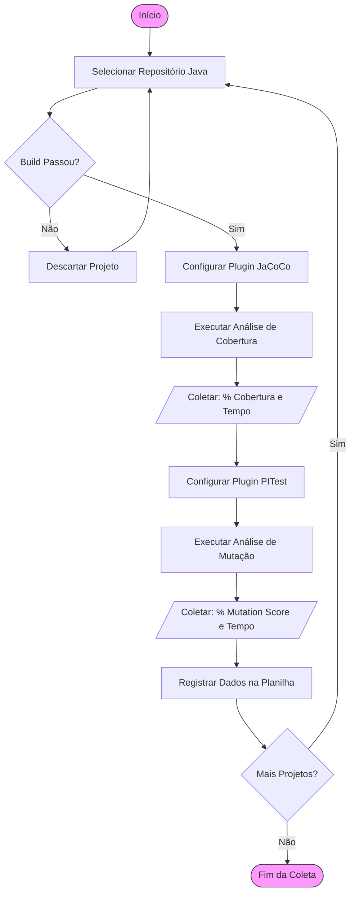

# Planejamento Experimental de TCC
**Título:** Análise Comparativa de Eficácia na Detecção de Falhas: Cobertura de Código vs. Teste de Mutação
**Aluno:** Ryan Cristian Oliveira Rezende
**Instituição:** Pontifícia Universidade Católica de Minas Gerais (PUC Minas)
**Data:** 05/12/2025
**Versão:** Final 1.0

---

## 1. Identificação Básica

### 1.1 Título do Experimento
Análise Comparativa de Eficácia na Detecção de Falhas: Cobertura de Código (Code Coverage) versus Teste de Mutação em Aplicações Java.

### 1.2 ID / Código
EXP-QA-MUTATION-2025

### 1.3 Datas
* **Início do Planejamento:** 22/11/2025
* **Consolidação Final:** 05/12/2025

### 1.4 Responsável Principal (PI)
Ryan Cristian Oliveira Rezende (`rcorezende@sga.pucminas.br`)

### 1.5 Iniciativa Relacionada
Trabalho de Conclusão de Curso (TCC) – Engenharia de Software. Investigação sobre métricas de qualidade de software e confiabilidade de suítes de testes.

---

## 2. Contexto e Problema

### 2.1 Descrição do Problema
No desenvolvimento de software moderno, a **Cobertura de Código (Code Coverage)** é amplamente utilizada como a principal métrica para determinar a qualidade de uma suíte de testes. Muitas organizações estabelecem metas rígidas (ex: 80% de cobertura) como critério de aceite.
Entretanto, observa-se o problema da "ilusão de qualidade": é possível atingir altas taxas de cobertura com testes fracos, que executam o código mas não verificam corretamente seus resultados (falta de asserções robustas). Isso leva a softwares que passam na pipeline de CI/CD, mas falham em produção.

### 2.2 Oportunidade
A oportunidade deste estudo é verificar se o **Teste de Mutação (Mutation Testing)** — uma técnica que insere defeitos propositais no código para testar a eficácia dos testes — é um indicador mais confiável de detecção de falhas do que a cobertura de código tradicional.

### 2.3 Contexto Técnico
* **Ambiente:** O experimento será realizado em notebook pessoal (Windows 11, Intel Core i5, 16GB RAM), garantindo isolamento.
* **Stack Tecnológica:** Projetos Open-Source em **Java** (JDK 8 a 21).
* **Ferramentas:**
    * **JUnit 5:** Framework de testes.
    * **JaCoCo:** Ferramenta padrão de mercado para Cobertura.
    * **PITest:** Ferramenta padrão para Teste de Mutação na JVM.

---

## 3. Objetivos e Questões (GQM)

### 3.1 Objetivo Geral
**Analisar** a eficácia da métrica de Cobertura de Código comparada à Pontuação de Mutação.
**Com o propósito de** avaliar a confiabilidade dos testes automatizados e identificar a "ilusão de qualidade".
**Sob a perspectiva** do Engenheiro de Software e QA.
**No contexto de** projetos open-source em Java.

### 3.2 Tabela GQM

| Objetivos Específicos | Questões de Pesquisa (Q) | Métricas Associadas (M) |
| :--- | :--- | :--- |
| **O1. Analisar Correlação** Verificar se cobrir linhas implica em matar mutantes. | **Q1.1** Projetos com alta cobertura (>80%) apresentam pontuação de mutação proporcionalmente alta? | M1. Line Coverage (%) M2. Mutation Score (%) |
| | **Q1.2** Existem casos de "falsos positivos" (Alta Cobertura e Baixa Mutação)? | M1, M2 |
| **O2. Avaliar Custo (Trade-off)** Comparar impacto no tempo de build. | **Q2.1** Qual a sobrecarga temporal (overhead) introduzida pelo teste de mutação? | M4. Test Time (ms) M5. Mutation Time (ms) |
| **O3. Investigar Defeitos** | **Q3.1** Qual a proporção de mutantes que sobrevivem mesmo em linhas cobertas? | M8. Surviving Mutants M1. Line Coverage |

### 3.3 Definição das Métricas Principais
* **M1. Line Coverage:** % de linhas executadas (Fonte: JaCoCo).
* **M2. Mutation Score:** % de mutantes mortos/detectados (Fonte: PITest).
* **M4. Test Time:** Tempo de execução dos testes unitários (Fonte: Maven/JUnit).
* **M5. Mutation Analysis Time:** Tempo total da análise de mutação (Fonte: PITest).

---

## 4. Escopo e Stakeholders

### 4.1 Escopo Funcional
* **Incluído (In-Scope):** Projetos Java, Build Maven/Gradle, Testes Unitários de Backend.
* **Excluído (Out-Scope):** Testes de UI, Testes de Integração com Banco de Dados, Projetos Android.

### 4.2 Stakeholders
1.  **Engenheiros de QA:** Interessados em ferramentas que garantam qualidade real.
2.  **Tech Leads:** Interessados no custo-benefício para pipelines de CI/CD.

---

## 5. Riscos e Critérios de Sucesso

### 5.1 Riscos de Alto Nível
1.  **Performance:** O PITest pode demorar excessivamente em projetos grandes. *Mitigação: Selecionar projetos menores (<50k LOC).*
2.  **Compatibilidade:** Falhas de build ao injetar plugins em projetos antigos. *Mitigação: Critério de inclusão rígido (apenas "Build Passing").*
3.  **Mutantes Equivalentes:** Falsos negativos técnicos da ferramenta. *Mitigação: Aceitar margem de erro estatístico.*

### 5.2 Critérios de Sucesso
Coleta completa de dados de no mínimo **3 projetos distintos**, permitindo a geração de gráficos comparativos e resposta às questões de pesquisa.

---

## 6. Modelo Conceitual e Hipóteses

### 6.1 Modelo Conceitual
`[Código Fonte + Testes] -> (Técnica: JaCoCo ou PITest) -> [Saída: % Cobertura, % Mutação, Tempo]`

### 6.2 Hipóteses Formais
* **H0 (Nula):** Existe uma correlação forte e positiva ($\rho \geq 0.8$) entre Cobertura de Linha e Mutation Score. (Interpretação: Cobertura alta já é suficiente).
* **H1 (Alternativa):** A correlação é fraca ou moderada ($\rho < 0.8$). (Interpretação: Cobertura alta não garante robustez).

---

## 7. Variáveis e Fatores

| Tipo | Variável | Descrição |
| :--- | :--- | :--- |
| **Independente** | Técnica de Avaliação | Tratamento 1: JaCoCo (Cobertura)   Tratamento 2: PITest (Mutação) |
| **Dependente** | Mutation Score | Indicador de robustez (% de falhas detectadas). |
| **Dependente** | Tempo de Execução | Custo computacional. |
| **Controle** | Tamanho (LOC) | Linhas de código do projeto. |

---

## 8. Desenho Experimental

O experimento segue um desenho de **Medidas Repetidas (Paired Design)**.
O mesmo objeto de estudo (projeto Java) será submetido a ambos os tratamentos. Isso elimina a variabilidade entre projetos, permitindo comparar diretamente como as métricas se comportam sobre a mesma base de código.

---

## 9. População, Sujeitos e Amostragem

### 9.1 População e Critérios
* **População:** Projetos Java Open-Source hospedados no GitHub.
* **Critérios de Inclusão:** Linguagem Java, Build Maven/Gradle, Testes JUnit 5, Build passando.
* **Critérios de Exclusão:** Projetos Android, Projetos gigantes (>50k LOC), Testes instáveis.

### 9.2 Amostragem
**Amostragem de Conveniência**, selecionando de 3 a 5 projetos relevantes para análise profunda, dado o alto custo computacional da mutação.

---

## 10. Instrumentação e Protocolo Operacional

### 10.1 Fluxograma do Experimento

   ### 10.2 Protocolo Resumido
1.  Clonar repositório do GitHub.
2.  Rodar `mvn clean test` (Verificação de saúde do build).
3.  Configurar plugin JaCoCo no `pom.xml` e rodar `mvn jacoco:report`. Coletar métricas.
4.  Configurar plugin PITest no `pom.xml` e rodar `mvn pitest:mutationCoverage`. Coletar métricas.
5.  Limpar (`mvn clean`) e repetir para o próximo projeto da amostra.

---

## 11. Plano de Análise de Dados

A análise será quantitativa e comparativa, focada em responder às questões GQM:
1.  **Análise de Correlação:** Geração de Gráfico de Dispersão (Scatter Plot) cruzando Cobertura (Eixo X) vs. Mutação (Eixo Y) para validar as hipóteses H0 e H1.
2.  **Análise de Custo:** Cálculo do fator de aumento de tempo (Razão: Tempo Mutação / Tempo Teste Unitário).
3.  **Tratamento de Dados:** Projetos com falha de execução ou timeout serão descartados e substituídos para não enviesar a média de tempo.

---

## 12. Avaliação de Validade (Ameaças e Mitigação)

### 12.1 Validade de Conclusão
* **Ameaça:** Baixo poder estatístico devido à amostra pequena (3 a 5 projetos).
* **Mitigação:** Foco em análise qualitativa e descritiva ("estudo de caso múltiplo"), evitando generalizações estatísticas fortes para toda a indústria.

### 12.2 Validade Interna
* **Ameaça:** Viés de instrumentação (falhas de build devido ao ambiente local do notebook pessoal).
* **Mitigação:** Protocolo rígido de inclusão (apenas projetos com "Build Passing"); uso de configurações padrão das ferramentas para evitar manipulação.

### 12.3 Validade de Construto
* **Ameaça:** Mutantes Equivalentes (o teste não mata o mutante porque a alteração não muda o comportamento do código, gerando um falso negativo).
* **Mitigação:** Uso dos operadores de mutação padrão da indústria (PITest defaults) e reconhecimento explícito da margem de erro técnica.

### 12.4 Validade Externa
* **Ameaça:** Resultados limitados ao ecossistema Open-Source Java (Bibliotecas).
* **Mitigação:** Delimitação explícita do escopo no relatório final: os resultados aplicam-se a Backend Java e não devem ser generalizados para Mobile, Frontend ou outras linguagens sem novos estudos.

---

## 13. Apresentação em Vídeo (Entrega Final)

Vídeo explicativo detalhando as ameaças à validade e o plano de mitigação, conforme solicitado na Entrega 5.

* **Link para o vídeo:** https://youtu.be/mZaC-a8_y_4
